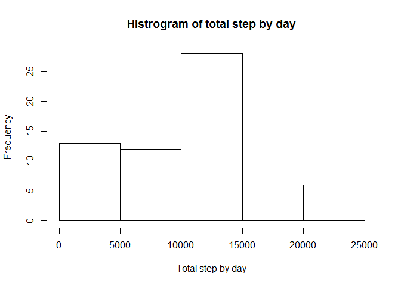
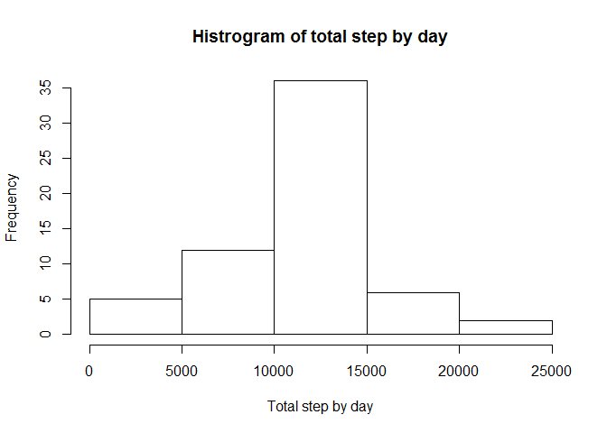

## 1. Data loading  
 
 
We are reading data for data analysis using below code: 

```r
library(knitr)
```

```
## Warning: package 'knitr' was built under R version 3.4.4
```

```r
opts_chunk$set(fig.path = "./figure/")
dataset<-read.csv("activity.csv")
```

Now, we check how data looks.


```r
str(dataset)
```

```
## 'data.frame':	17568 obs. of  3 variables:
##  $ steps   : int  NA NA NA NA NA NA NA NA NA NA ...
##  $ date    : Factor w/ 61 levels "2012-10-01","2012-10-02",..: 1 1 1 1 1 1 1 1 1 1 ...
##  $ interval: int  0 5 10 15 20 25 30 35 40 45 ...
```

As we can see, variable date was loaded as factor. Because it indicates date, we must to reorginize data.


```r
dataset$date<-as.Date(dataset$date, "%Y-%m-%d")
str(dataset)
```

```
## 'data.frame':	17568 obs. of  3 variables:
##  $ steps   : int  NA NA NA NA NA NA NA NA NA NA ...
##  $ date    : Date, format: "2012-10-01" "2012-10-01" ...
##  $ interval: int  0 5 10 15 20 25 30 35 40 45 ...
```

Now data has suitable format for futher analysis.


```r
head(dataset)
```

```
##   steps       date interval
## 1    NA 2012-10-01        0
## 2    NA 2012-10-01        5
## 3    NA 2012-10-01       10
## 4    NA 2012-10-01       15
## 5    NA 2012-10-01       20
## 6    NA 2012-10-01       25
```


## 2. Analysis of steps number by days

In this section, we are considering how looks steps number in daily habit. First of all let's have a look on number of total steps calculated per day. We show only first few rows to see data.


```r
library(dplyr)
total_per_day<-group_by(dataset,date)%>%summarize(sum=sum(steps, na.rm=T))
total_per_day[which.max(total_per_day$sum),]
```

```
## # A tibble: 1 x 2
##   date         sum
##   <date>     <int>
## 1 2012-11-23 21194
```

```r
head(total_per_day,12) 
```

```
## # A tibble: 12 x 2
##    date         sum
##    <date>     <int>
##  1 2012-10-01     0
##  2 2012-10-02   126
##  3 2012-10-03 11352
##  4 2012-10-04 12116
##  5 2012-10-05 13294
##  6 2012-10-06 15420
##  7 2012-10-07 11015
##  8 2012-10-08     0
##  9 2012-10-09 12811
## 10 2012-10-10  9900
## 11 2012-10-11 10304
## 12 2012-10-12 17382
```
  
The most steps was made in 21st November 2012 and it was 21194 steps.

To see have this data looks, we can make plot some histogram.


```r
hist(total_per_day$sum, xlab="Total step by day", main="Histrogram of total step by day")
```

<!-- -->

We can observe that the most frequance are results between 10000 and 15000 steps which was reached in circum 25 days in our survey.  

Now we check how look median and mean of step by day.  


```r
mean1<-format(mean(total_per_day$sum, na.rm=T),digits=6)
```

```r
median1<-median(total_per_day$sum, na.rm=T)
```

Mean of total steps taken by day is equal 9354.23 and median is equal 10395.

## 3. Research for daily activity pattern.

In this section we are considering how looks pattern of daily activities. Firstly we'll prepare time series plot with 5-minutes intervals as x-axis and averaged value of steps over all days. Before plotting, we must convert variable interval into time format and then we can easily see how numbers of steps is changing over all day.


```r
average_interval<-with(dataset, tapply(steps,interval,mean, na.rm=T))
interval5<-dataset$interval
interval5[nchar(interval5)==2]<-paste("00",interval5[nchar(interval5)==2],sep="")
interval5[nchar(interval5)==1]<-paste("000",interval5[nchar(interval5)==1],sep="")
interval5[nchar(interval5)==3]<-paste("0",interval5[nchar(interval5)==3],sep="")
interval5<-strptime(interval5,"%H%M")
plot(unique(interval5),average_interval, type="l", xlab="Time",ylab="Steps number", main="Time series of average steps number in 5-minutes intervals")
```

<!-- -->


```r
max_interval<-rownames(average_interval)[which.max(average_interval)]
```

```r
max_steps<-max(average_interval)
```

The interval with the most numbers of steps is 835 with averaged 206.1698113 number of steps. This indicates that the most numbers of steps are done during morning, when people wake up and go to work/school/university.

## 4. Dealing with missing data

We see that few first rows has missing value of steps. We'll check how many observations we must exclude from analysis becauese of missing data.


```r
sum(is.na(dataset$steps))
```

```
## [1] 2304
```

```r
mean(is.na(dataset$steps))
```

```
## [1] 0.1311475
```

We see around 13% observations with missing step value. It is quite big figure. In this case, good habit is to impute some data instead of missing data. There are a lot of ideas how it can be done. In this analysis, we put averaged steps value for intervals instead of NAs. Using day means is not suitable, because we have NAs only for all day cases.


```r
exclNA<-dataset
average_interval<-as.data.frame(cbind(intervals=rownames(average_interval),avg.steps=round(average_interval,0)))

for(i in seq_along(exclNA$steps)){
  if(is.na(exclNA[i,"steps"])) exclNA[i,"steps"]<-filter(average_interval,exclNA[i,"interval"]==average_interval$intervals)%>%select(avg.steps)
}
```

Now, having data set without NAs, we can draw histogram of total number of steps taken by day and calculate median and mean of this numbers. Then we could compare it with original numbers to check what is the impact of agreed methodology of excluding NAs.


```r
total_per_day1<-group_by(exclNA,date)%>%summarize(sum=sum(steps))
hist(total_per_day1$sum, xlab="Total step by day", main="Histrogram of total step by day")
```

<!-- -->

```r
mean2<-format(mean(total_per_day1$sum, na.rm=T),digits=7)
```

```r
median2<-median(total_per_day1$sum, na.rm=T)
```

'New' mean and median of total steps are equal (respectively) 10800.26 and 11026. To compare with original data have a look on table below.

```r
comp<-data.frame(cbind(mean=c(mean1,mean2),median=c(median1,median2)),row.names=c("original","withoutNAs"))
comp$mean<-as.double(as.character(comp$mean))
comp$median<-as.integer(as.character(comp$median))
comp
```

```
##                mean median
## original    9354.23  10395
## withoutNAs 10800.26  11026
```

```r
mean_compare<-paste(format((comp[2,1]/comp[1,1]-1)*100,digits=4),"%",sep="")
median_compare<-paste(format((comp[2,2]/comp[1,2]-1)*100,digits=4),"%",sep="")
```

We can see that two numbers, median and mean, increased after removing NA values, so it is logical, because in substitute NAs with positive numbers. Mean increased of 15.46% and median increased of 6.07%.  
Also if we look on histogram, we see that we have about 35 days with total number of steps between 10 000 and 15 000. 

## 5. Difference in activity between weekdays and weekends

The final part of analysis refers to how looks activity in weekday and weekends. We must to create new variable in our dataset with excluded NAs, which will indicates if day is weekend or weekday. In code below was used polish names of Sunday ("niedziela") and Saturday ("sobota"). If you will reproduce this code, please use your local names.


```r
exclNA<-mutate(exclNA,day=ifelse(weekdays(date)%in%c("niedziela","sobota"),"Weekend","Weekday"))
exclNA$day<-as.factor(exclNA$day)
summary(exclNA)
```

```
##      steps            date               interval           day       
##  Min.   :  0.0   Min.   :2012-10-01   Min.   :   0.0   Weekday:12960  
##  1st Qu.:  0.0   1st Qu.:2012-10-16   1st Qu.: 588.8   Weekend: 4608  
##  Median :  0.0   Median :2012-10-31   Median :1177.5                  
##  Mean   : 37.5   Mean   :2012-10-31   Mean   :1177.5                  
##  3rd Qu.: 30.0   3rd Qu.:2012-11-15   3rd Qu.:1766.2                  
##  Max.   :806.0   Max.   :2012-11-30   Max.   :2355.0
```

We would like to see how looks average nunmber of steps by intervals in weekend and weekdays. Firstly, we'll preapre data for this. Secondly, we plot charts for comparing.


```r
avg.intervals.exNA<-group_by(exclNA,interval,day)%>%summarize(steps=mean(steps))
par(mfrow=c(2,1),mar=c(4,4,2,2))
with(subset(avg.intervals.exNA,day=="Weekend"),plot(interval, steps,type="l",xlab="Time interval",ylab="Steps", main="Average steps number in Weekend",ylim=c(0,max(avg.intervals.exNA$steps))))
with(subset(avg.intervals.exNA,day=="Weekday"),plot(interval, steps,type="l",xlab="Time interval",ylab="Steps", main="Average steps number in Weekday",ylim=c(0,max(avg.intervals.exNA$steps))))
```

<!-- -->

Looking at plot we see that in weekdays we have maximum number of averaged steps larger than in weekend. Steps in weekend are distributed more equal than in weekdays when we have large peak in morning hours.
